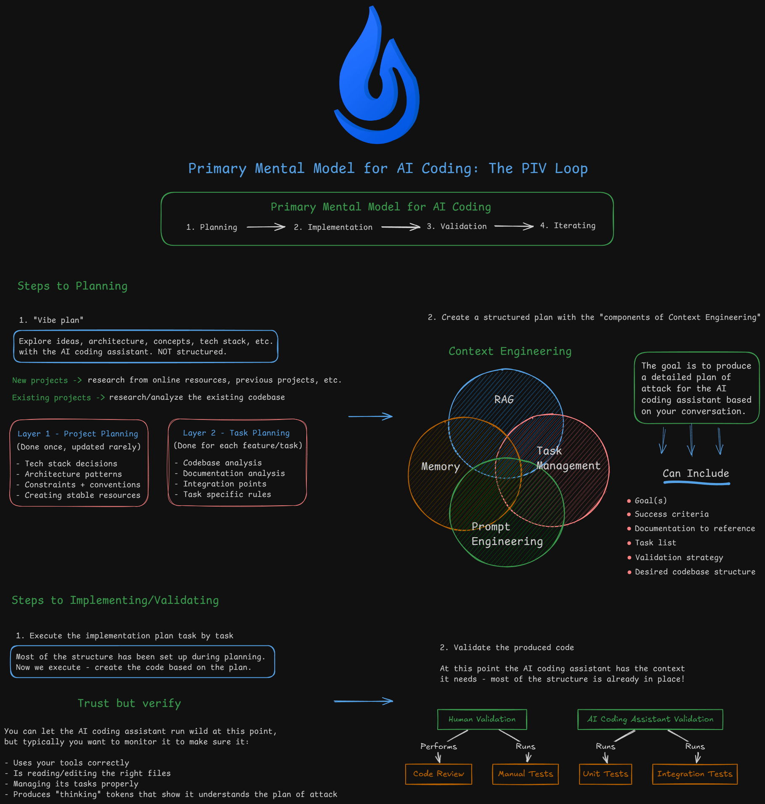

# Workshop Template

This is a template repository for the github copilot agentic coding workshop. It contains the scaffolding and skills needed to build a full-stack application with github copilot agent.

## What's Included

- **`.github/skills/`** - github copilot agent skills for planning, execution, validation, and workflow automation
- **`.github/instructions/`** - instructions for copilot agent the best practices documentation for various technologies
- **`.github/copilot-instructions.md`** - Template for project-specific instructions (fill this in as you build)

## Getting Started

1. **Fork or clone** this repository
2. **Define your project** — Have a conversation with your AI coding assistant about what you want to build. Discuss requirements, features, and technical decisions.
3. **Create your PRD** — Run `/create-prd` to generate a Product Requirements Document based on your conversation
4. **Build your .github/copilot-instructions.md** — Work with the AI assistant to fill in the `copilot-instructions.md` template with your project's tech stack, structure, conventions, and commands
5. **Create instructions documents** — Add detailed guides to `.github/instructions/` for specific parts of your codebase (e.g., API patterns, database conventions, deployment strategies). Keep your `copilot-instructions.md` concise and point to these references when needed — this prevents overwhelming the LLM with context while still giving detailed guidance when working on specific areas.
6. **Start building** — Use the development workflow:
   - `/core-piv-loop-prime` — Load project context
   - `/core-piv-loop-plan-feature` — Create an implementation plan for a feature
   - `/core-piv-loop-execute` — Execute the plan step-by-step

   These commands follow the **PIV Loop** (Prime → Implement → Validate) workflow:

   

## Github Copilot Skills

Skills for Github Copilot to assist with development workflows.

### Planning & Execution
| Command | Description |
|---------|-------------|
| `/core-piv-loop-prime` | Load project context and codebase understanding |
| `/core-piv-loop-plan-feature` | Create comprehensive implementation plan with codebase analysis |
| `/core-piv-loop-execute` | Execute an implementation plan step-by-step |

### Validation
| Command | Description |
|---------|-------------|
| `/validation-validate` | Run full validation: tests, linting, coverage, build (customize to your project) |
| `/validation-code-review` | Technical code review on changed files |
| `/validation-code-review-fix` | Fix issues found in code review |
| `/validation-execution-report` | Generate report after implementing a feature |
| `/validation-system-review` | Analyze implementation vs plan for process improvements |

### Misc
| Command | Description |
|---------|-------------|
| `/commit` | Create atomic commit with appropriate tag (feat, fix, docs, etc.) |
| `/init-project` | Install dependencies and start development servers (customize this to your project) |
| `/create-prd` | Generate Product Requirements Document from conversation |
